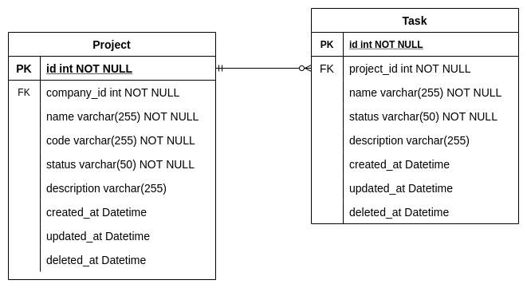
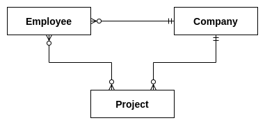
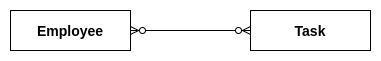

# Let's GO Project

## I. What to do
In this service, you will develop a backend server side functions that handle the **project** and **task** API
resources.This service will contain 2 sub-services which are the Rest and gRPC service.
Rest service will handle the http requests while gRPC will handle the rpc request to the API resources.

**The project and task ERD can be referred below:** \

**The relationship between project, company and employee can be referred below:** \

**The relationship between task and employee can be referred below:** \

## II. API Output
### 1. Project API Output
#### 1.1. Get a project by ID.
    - URL: [GET] {project_url}/go/project/{id}
    - Response:
        {
            "id": "string",
            "company_id": "string",
            "name": "string",
            "code": "string",
            "status": "string",
            "total_task": 0, // calculate the total number of tasks
            "description": "string",
            "created_at": "string",
            "updated_at": "string"
        }
#### 1.2. Create a project for a specific company.
    - URL: [POST] {project_url}/go/company/{company_id}/project
    - Payload:
        {
            "company_id": "string",
            "name": "string",
            "code": "string",
            "status": "string", // allowed values: "active", "inactive"
            "description": "string",
        }
    - Response:
        {
            "id": "string",
            "company_id": "string",
            "name": "string",
            "code": "string",
            "status": "string",
            "total_task": 0, // calculate the total number of tasks
            "description": "string",
            "created_at": "string",
            "updated_at": "string"
        }
#### 1.3. Update a project by ID.
    - URL: [PUT] {project_url}/go/project/{id}
    - Payload:
        {
            "id": "string",
            "company_id": "string",
            "name": "string",
            "code": "string",
            "status": "string", // allowed values: "active", "inactive"
            "description": "string",
        }
    - Response:
        {
            "id": "string",
            "company_id": "string",
            "name": "string",
            "code": "string",
            "status": "string",
            "total_task": 0, // calculate the total number of tasks
            "description": "string",
            "created_at": "string",
            "updated_at": "string"
        }
#### 1.4. Delete a project by ID.
    - URL: [DELETE] {project_url}/go/project/{id}
    - Status: 200
#### 1.5. List project by company id, page, limit, status and filter by "name", "code".
    - URL: [GET] {project_url}/go/company/{company_id}/projects
    - Query: ?page=0&limit=0&status=string&search_value=string&search_fields=name,code
    - Response:
        {
            "items": [
                {
                    "id": "string",
                    "company_id": "string",
                    "name": "string",
                    "code": "string",
                    "status": "string",
                    "description": "string",
                    "created_at": "string",
                    "updated_at": "string"
                },
                ...
            ]
            "max_page": 0,
            "total_count": 0,
            "page": 0,
            "limit": 0,
        }
#### 1.6. Assign an employee to a project.
    - URL: [POST] {project_url}/go/project-assign
    - Payload:
        {
            "project_id": "string",
            "employee_id": "string",
        }
    - Status: 200
    - Assign Condition: project must has status of "active"
#### 1.7. Dismiss an employee from a project.
    - URL: [POST] {project_url}/go/project-dismiss
    - Payload:
        {
            "project_id": "string",
            "employee_id": "string",
        }
    - Status: 200
    - Dismiss Condition: employee must not have any "active" task in project
#### 1.8. List employee by a specific project id
    - URL: [GET] {project_url}/go/project-employees/{project_id}
    - Response:
        {
            "items": [
                {
                    "id": "string",
                    "company_id": "string",
                    "name": "string",
                    "email": "string",
                    "dob": "string",
                    "gender": "string",
                    "role": "string",
                    "created_at": "string",
                    "updated_at": "string"
                },
                ...
            ]
            "total_count": 0,
        }

### 2. Task API Output
#### 2.1. Get a task by ID.
    - URL: [GET] {project_url}/go/task/{id}
    - Response:
        {
            "id": "string",
            "project_id": "string",
            "name": "string",
            "status": "string",
            "description": "string",
            "created_at": "string",
            "updated_at": "string"
        }
#### 2.2. Create a task for a specific project.
    - URL: [POST] {project_url}/go/project/{project_id}/task
    - Payload:
        {
            "project_id": "string",
            "name": "string",
            "status": "string", // allowed values: "to_do", "doing", "done"
            "description": "string",
        }
    - Response:
        {
            "id": "string",
            "project_id": "string",
            "name": "string",
            "status": "string",
            "description": "string",
            "created_at": "string",
            "updated_at": "string"
        }
#### 2.3. Update a task by ID.
    - URL: [PUT] {project_url}/go/task/{id}
    - Payload:
        {
            "id": "string",
            "project_id": "string",
            "name": "string",
            "status": "string", // allowed values: "to_do", "doing", "done"
            "description": "string",
        }
    - Response:
        {
            "id": "string",
            "project_id": "string",
            "name": "string",
            "status": "string",
            "description": "string",
            "created_at": "string",
            "updated_at": "string"
        }
#### 2.4. Delete a task by ID.
    - URL: [DELETE] {project_url}/go/task/{id}
    - Status: 200
#### 2.5. List task by project id, page, limit, status and filter by "name".
    - URL: [GET] {project_url}/go/project/{project_id}/tasks
    - Query: ?page=0&limit=0&status=string&search_value=string&search_fields=name
    - Response:
        {
            "items": [
                {
                    "id": "string",
                    "project_id": "string",
                    "name": "string",
                    "status": "string",
                    "description": "string",
                    "created_at": "string",
                    "updated_at": "string"
                },
                ...
            ]
            "max_page": 0,
            "total_count": 0,
            "page": 0,
            "limit": 0,
        }
#### 2.6. Assign a task to an employee.
    - URL: [POST] {project_url}/go/task-assign
    - Payload:
        {
            "task_id": "string",
            "employee_id": "string",
        }
    - Status: 200
    - Assign Condition: task must has status of "to_do" and employee must be assigned to the task project
#### 2.7. Un-assign a task from an employee.
    - URL: [POST] {project_url}/go/task-unassign
    - Payload:
        {
            "task_id": "string",
            "employee_id": "string",
        }
    - Status: 200
    - Unassign Condition: Task must not have a status of "doing"
#### 2.8. List task by a specific employee id and task status
    - URL: [GET] {project_url}/go/employee-tasks/{employee_id}
    - Query: ?task_status=string
    - Response:
        {
            "items": [
                {
                    "id": "string",
                    "project_id": "string",
                    "name": "string",
                    "status": "string",
                    "description": "string",
                    "created_at": "string",
                    "updated_at": "string"
                },
                ...
            ]
            "total_count": 0,
        }

> NOTE: DO NOT commit changes directly into the master branch.